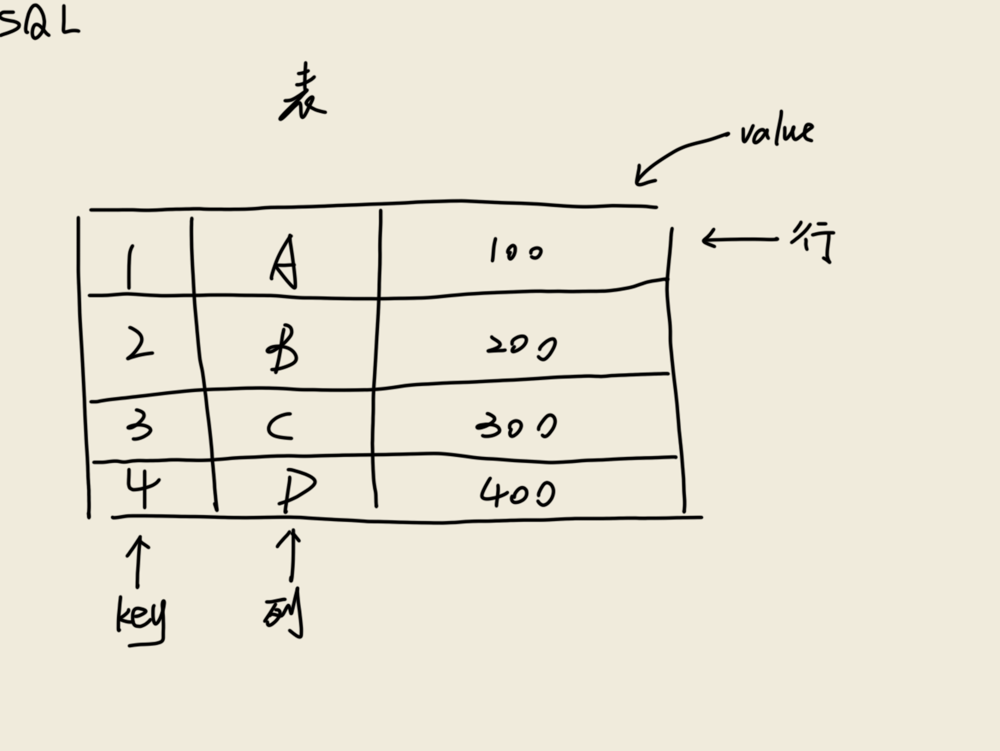
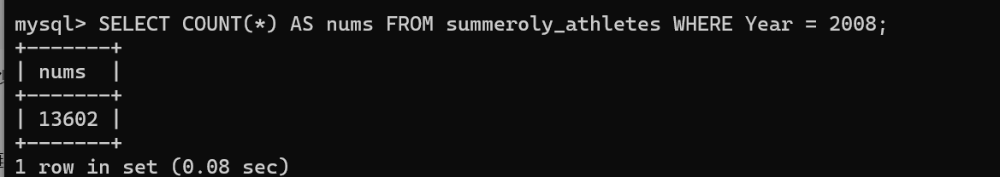

#### 表/行/列分别是什么？主键的作用是什么？
表：一个完整的数据集合，储存相关的所有数据  
行：一个独立的数据实体  
列：代表数据的某一属性  
主键：主键是表中唯一标识每一行记录的一列或一组列，用于精确查找每一行数据，构建不同表之间的关联，提高查询效率  

#### MySQL的常见数据类型有哪些？要清楚在什么情境下使用。
##### 数值类型：  
TINYINT：-128 ~ 127，常用于状态值（如性别 0/1）  
SMALLINT：-32768 ~ 32767，小范围计数（如城市 ID）  
MEDIUMINT：-8388608 ~ 8388607，中型数据（如用户 ID）  
INT：-2^31 ~ 2^31-1，主键、常规计数（最常用）  
BIGINT：-2^63 ~ 2^63-1，超大数据（如交易流水号） 
FLOAT：单精度浮点，7位有效数字，科学计算、非精确数据（如温度）  
DOUBLE：双精度浮点，15位有效数字，普通计算（如地理坐标）  
DECIMAL(M,D)：精确小数（M总位数，D小数位），金融金额、需精确计算的场景  
##### 字符串类型：  
CHAR：定长，不足补空格，最多 255 字符，固定长度数据（如 MD5 值、邮编）  
VARCHAR：变长，按需存储，最多 65535 字节，变长文本（如用户名、地址）  
TEXT：65535字节，文章摘要、评论  
MEDIUMTEXT： 0~167772150字节，小说、长文档  
LONGTEXT：0~4294967295字节，超长内容（如电子书）  
##### 时间类型：
YEAR YYYY 1901~2155，1个字节  
TIME HH:MM:SS -838:59:59~838:59:59，3个字节  
DATE YYYY-MM-DD 1000-01-01~9999-12-3，3个字节  
DATETIME YYYY-MM-DD HH:MM:SS，8个字节  
TIMESTAMP YYYY-MM-DD HH:MM:SS，4个字节  
##### 二进制类型：
BINARY(M)：字节数为M，允许长度为 0~M 的定长二进制字符串  
VARBINARY(M)：允许长度为 0~M 的变长二进制字符串，字节数为值的长度加1  
BIT(M)：M位二进制数据，M最大值为64  
TINYBLOB：可变长二进制数据，最多 255个字节  
BLOB：可变长二进制数据，最多2^16-1个字节  
MEDIUMBLOB 可变长二进制数据，最多2^24-1个字节  
LONGBLOB 可变长二进制数据，最多2^32-1个字节  
#### DDL/DML/DQL/DCL 分别是什么？各举 2 个例子。
DDL：定义或修改数据库结构，自动提交事务（无法回滚）  
```sql
CREATE TABLE Users (
    id INT PRIMARY KEY,
    name VARCHAR(50) NOT NULL,
    created_at DATETIME DEFAULT CURRENT_TIMESTAMP
); 
-------------
ALTER TABLE Users ADD email VARCHAR(100); 
ALTER TABLE Orders RENAME COLUMN order_date TO created_at; 
```
DML：操作表中的数据（增删改），需显式提交事务（可回滚）  
```sql
INSERT INTO Users (id, name) VALUES (1, 'Alice');
-------------
UPDATE Users SET email = 'alice@example.com' WHERE id = 1; 
```
DQL：从表中检索数据（不修改数据）  
```sql
SELECT name, email FROM Users WHERE id = 1; 
------------
SELECT product_id, SUM(quantity) AS total_sales 
FROM Orders 
GROUP BY product_id 
HAVING total_sales > 100;
```
DCL：管理数据库访问权限  
```sql
GRANT SELECT, INSERT ON Users TO 'analyst'; 
------------
REVOKE DELETE ON Orders FROM 'intern';
```
#### 聚合查询中 WHERE 和 HAVING 的区别？
|特性|WHERE|HAVING|
|--|--|--|
|作用|过滤原始数据|过滤聚合结果|
|过滤时机|在分组前（GROUP BY之前）过滤原始数据|在分组后（GROUP BY之后）过滤聚合结果|
|作用对象|单条记录（行级过滤）|分组后的聚合结果（组级过滤）|
|能否用聚合函数|不可直接使用（如SUM()、AVG()）|必须配合聚合函数使用|
|执行顺序|早于GROUP BY和HAVING	|晚于GROUP BY，早于SELECT|

优先用WHERE：  
尽量在WHERE中提前过滤数据，减少GROUP BY处理的数据量  
避免HAVING滥用：  
若无聚合条件，直接使用WHERE替代HAVING
#### 常见字段约束有哪些？
主键约束（PRIMARY KEY）：确保值唯一且非空  
唯一约束（UNIQUE）：确保字段值唯一，但允许 NULL 值（多个 NULL 视为不同值）  
非空约束（NOT NULL）：强制字段不允许存储 NULL 值，常用于必填项  
默认值约束（DEFAULT）：当插入数据未指定字段值时，自动填充预设的默认值  
外键约束（FOREIGN KEY）：确保字段值必须存在于另一表的主键中  
#### INNER JOIN 和 LEFT JOIN 区别是什么？什么时候必须用 LEFT JOIN？
|特性|INNER JOIN|LEFT JOIN|
|--|--|--|
|匹配逻辑|仅返回两表匹配成功的行|返回左表所有行 + 右表匹配的行（不匹配则补 NULL）|
|结果集范围|交集数据|左表全集 + 右表匹配数据|
|NULL 值产生|不会产生 NULL|右表未匹配时自动填充 NULL|
|数据丢失风险|左/右表不匹配的数据会被丢弃|左表数据永不丢失|

必须用LEFT JOIN:  
需要保留主表全部记录  
示例：统计所有用户的订单量（包括未下单用户）  
```sql
SELECT Users.name, COUNT(Orders.id) AS order_count
FROM Users
LEFT JOIN Orders ON Users.id = Orders.user_id
GROUP BY Users.id;
```
检测数据缺失或异常 
```sql
SELECT Users.*
FROM Users
LEFT JOIN Orders ON Users.id = Orders.user_id
WHERE Orders.id IS NULL; 
``` 
多级关联查询中避免数据丢失  
```sql
SELECT Users.name, Logistics.tracking_id
FROM Users
LEFT JOIN Orders ON Users.id = Orders.user_id
LEFT JOIN Logistics ON Orders.id = Logistics.order_id;
```
必须用INNER JOIN：  
两表必须严格匹配  
关联数据缺失则结果无意义  
追求更高查询性能  
#### 什么是事务？提交/回滚是什么？并发下可能出现哪些问题（至少说 2 个）？
##### 事务
是数据库操作的最小逻辑单元，由一组不可分割的 SQL 语句组成。这些操作要么全部成功执行（提交），要么全部失败回滚，确保数据从一种一致状态转换到另一种一致状态  
##### 提交
确认事务中的所有操作，将临时修改永久写入数据库。提交后数据对其他事务可见，且无法撤销  
##### 回滚
撤销事务中的所有操作，将数据库恢复到事务开始前的状态。  
关键区别：  
提交后数据永久生效；回滚后数据如同事务从未发生。未提交的事务修改仅对当前事务可见
##### 并发问题
脏读：事务A读取事务B未提交的修改。若B回滚，则A读到无效数据  
不可重复读：事务A多次读取同一数据，因事务B 提交更新，A前后结果不一致
幻读（：事务A按条件查询，因事务B 提交插入/删除，A两次结果集行数不同  
### 运行结果
#### 参加次数

#### 运动员总数