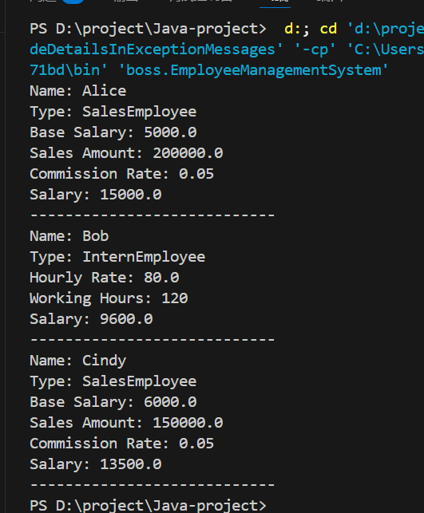

### 运行结果

### 问题回答
#### 3. 本系统中是如何体现  
请分别结合代码说明：  
##### 封装（Encapsulation）  
将对象的属性隐藏，从而防止外部类随意修改、访问类的属性。如：
```java
abstract class Employee implements Payable{
    private String name;
    public String getName() {
        return name;
    }
}
```
name属性为private,无法在外部类直接通过`Payable.name`访问和修改，只能通过getName方法访问，防止name属性被修改
##### 继承（Inheritance） 
使一个类可以使用另一个类或接口中的属性和方法，便于代码的重复使用.子类可以使用父类的属性、方法，也可以重写父类的方法。如：
```java
class SalesEmployee extends Employee {
    private double baseSalary;
    private double salesAmount;
    public SalesEmployee(String name, double baseSalary, double salesAmount) {
        super(name);
        this.baseSalary = baseSalary;
        this.salesAmount = salesAmount;
    }
    public double calculateSalary() {
        double re = 0;
        re = baseSalary + salesAmount * 0.05;
        return re;
    }
}
``` 
SalesEmployee继承了父类Employee，使用父类的构造函数`super(name)`为继承的name属性赋值，重写父类的抽象函数calculateSalay为正式员工的薪酬计算方式，继承了printEmployeeInfo方法。简化了构造函数与属性初始化，不用重复写相同方法
##### 多态（Polymorphism）  
一个父类可以指向不同的子类，执行子类重写后的方法
```java
List<Employee> employees = new ArrayList<>();
employees.add(new SalesEmployee("Alice", 5000, 200000));
employees.add(new InternEmployee("Bob", 80, 120));
employees.add(new SalesEmployee("Cindy", 6000, 150000));
```
SalesEmployee、InternEmployee继承Employee  
子类重写了calculateSalay方法  
employees的类型为Employee，但添加了SalesEmployee、InternEmployee等子类元素，执行子类的方法。 
使calculateSalay方法在不同的对象中执行不同的操作
#### 4. 本题中为什么要同时使用  
请回答：  
##### 抽象类与接口在 Java 中的区别  
1. 属性：  
抽象类的属性与普通类相同，接口的属性只能为常量`public static final`
2. 方法：
抽象类既可以有普通方法，也可以有抽象方法，可以有构造函数，接口只能有抽象方法且不能有构造函数  
3. 继承：
抽象类只能被单继承，使用`extends`关键字，接口可以被多继承，即一个类可以实现多个接口，使用`implements`关键字
##### 为什么这里 Employee 用抽象类，而薪资能力用接口？  
Employee为SalesEmployee、InternEmployee的算法骨架，且是对员工这一类的抽象，而Payable是对支付工资这一行为的抽象化，规定所有实现该接口的类必须有Payable方法。
##### 如果只保留其中一种，会有什么问题？  
Payable方法被认为是类的共性，可能有类不需要Payable方法但被强制要求包含或某些类不需要员工的方法却必须要实现，且若只有接口，则name属性被强制要求为常量，无法修改。
#### 5. 为什么 Employee 中的属性要声明为 private？  
##### 这样做如何体现封装？  
name属性无法直接在外部类访问，只能通过getter方法间接访问，控制外部类的访问权限，隐藏数据
##### 如果不使用 private，可能带来什么问题？  
可能导致外部类直接访问name属性，导致name在过程中被无意修改
#### 6. 什么是方法签名？重写时有哪些规则？  
##### 方法签名包含哪些部分？  
由方法名和参数列表组成
##### calculateSalary() 在父类和子类中的方法签名是否一致？为什么要保持一致？  
一致，否则变为方法重载。需要保证两个方法为同一方法，使编译器可以正确找到该方法
##### 如果子类把 calculateSalary() 参数列表改了，会发生什么？这叫重写还是重载？  
重载，在输入参数不符合函数要求时不再执行该方法，可能使多态失效，或者使编译器找不到正确方法，编译失败
#### 7. 附加问题  
##### @Override 的作用是什么？不写行不行？  
作用是方法重写，补全calculateSalar的逻辑，使其变为具体函数，使该类可以实例化，不写则该类仍为抽象类，无法实例化，无法计算工资
##### 父类引用指向子类对象时，调用方法是编译期绑定还是运行期绑定？ 
运行期绑定。编译器在编译阶段只能获取被调用方法的方法签名，检查方法签名是否一致，但具体执行哪个类的方法运行时需要根据使用对象的实际类型决定  
静态绑定适用于static方法、final方法、private方法、构造函数，这些方法在编译时即可确定具体对象
动态绑通过过虚方法表实现，类在加载时生成一个虚方法表，存储该类所有可重写方法的入口地址，调用方法时，JVM根据对象的实际类型寻找对应的虚方法表，从而找到在子类中被重写的方法
##### protected 与 private 在继承中的差异是什么？什么时候选 protected？  
private仅能在本类中调用，继承后子类不可直接访问，防止数据、方法被修改，protected可以本包直接调用，在继承后子类也可跨包调用，子类也可重写方法，修改属性。protected常用于函数的重写，用于抽象类来构造类的模板。
####  
TODO：思考 name 为什么是 private？  
防止name被外部类直接访问  
TODO：是否需要提供 getter / setter？  
需要getter来获取name，不需要setter修改name  
TODO：baseSalary 和 salesAmount 是否应该直接暴露？  
不应该，可能会被修改