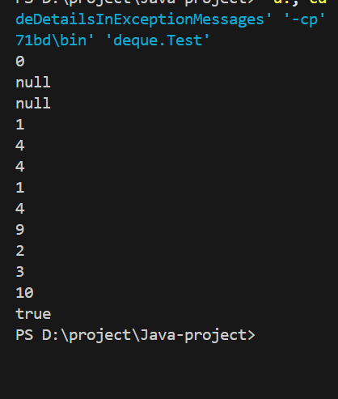
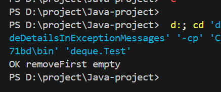
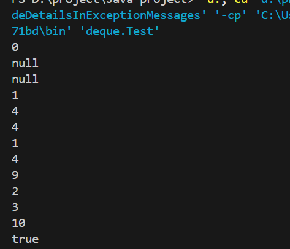
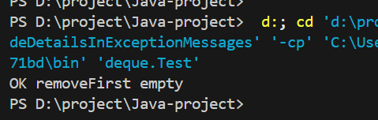
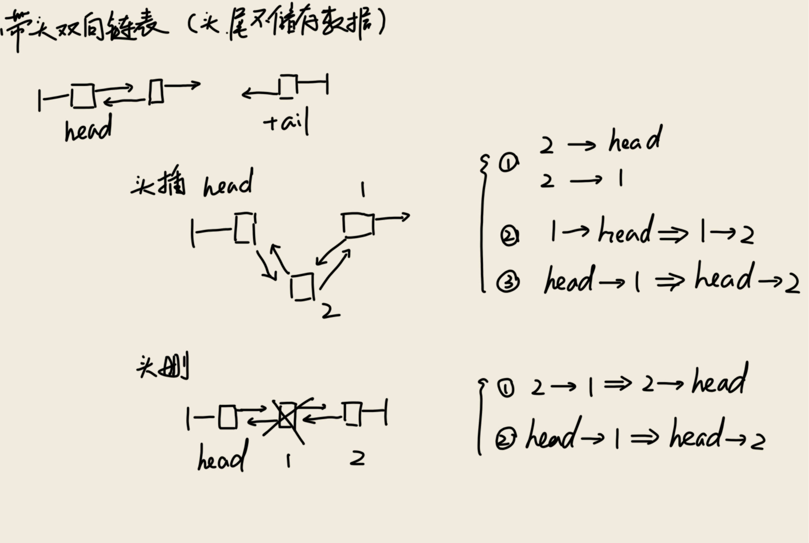
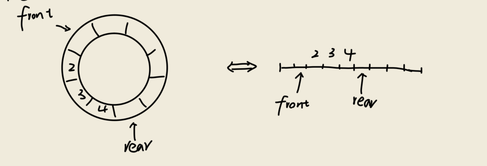

## 运行结果
### 普通数组版本测试样例
#### 正常用例

#### 边界测试

### 环形数组版本测试样例  
#### 正常用例

#### 边界测试

## 双向有头链表
  
双向链表一个指针指向上一个，一个指针指向下一个
```
prev<--node-->next
```
同时拥有一个头节点head和一个尾节点tail，头尾节点不储存数据  
#### 头插
首先创建目标节点node，随后该节点的next指针指向下一个，prev指针指向上一个。随后修改后一个节点的prev指针指向node,修改head的next指针指向node。  
#### 头删
无需修改node的指针，直接修改head的next指针与后一个节点的prev指针，且删除的节点无需手动free
## 列表的头插
法一：给出的代码采用依次向后移动一位，再在首位增添一个。不改变指针，但是复杂度为O(n)且存在溢出风险  
```java
private void arrayAddFirst(E x) {
        for (int i = backSize - 1; i >= 0; i--) arr[i + 1] = arr[i];
        arr[0] = x;
        backSize++;
    }
```
法二：将数组转换为ArrayList，然后使用add方法添加新元素。最后将ArrayList转换回数组。时间复杂度为O(1)，但是改变了指针
```java
private void arrayAddFirst(E x) {
        List<E> list = new ArrayList<String>(Arrays.asList(arr));
        list.add(x);
        E[] extendedArray = list.toArray(new String[list.size()]);
    }
```
## 环形数组
使用环形数组可以避免数组溢出  
以front指针指向头，以rear指针指向尾，以逻辑上的圆环构造数组。

指针前进`point = (point + 1) % arr.lenth`  
指针后退`point = (point - 1) % arr.lenth`  
指针在大于数组长度后通过取余回到数组上，构成逻辑上的圆环
## 异常处理
考虑了三种异常：列表溢出和列表大小<=0的非法异常`IllegalStateException`与删除空队列时的空异常`NoSuchElementException`  
同时为了平衡前段与后端的存储数量，采用`rebalance`函数将多余的对象转移到另一段。